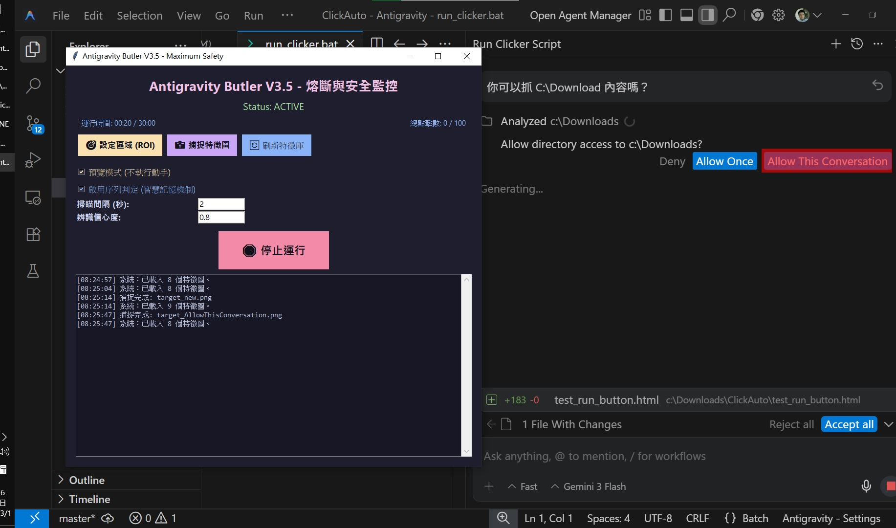

# 🛡️ Antigravity-Auto-Permit (Butler V3.5)

## 🎯 解決痛點：不再被 「Run」 與 「Allow」 中斷
這是一個專為解決 **Antigravity** 在操作過程中頻繁跳出授權按鈕而設計的視覺自動化工具。它能「看見」螢幕上的特定圖案，並以擬人路徑自動執行點擊，讓您專注於程式開發。

這是一個專為 Windows 環境設計的**全視覺驅動 (Vision-Driven)** 自動化工具。它能「看見」螢幕上的特定圖案，並以「模擬真人」的方式執行點擊、授權或訊息回饋任務。

## 🌟 核心理念：See & Do (視覺即邏輯)
本工具不依賴底層 API，而是模仿人類眼睛與雙手：
**IF** 在設定區域 (ROI) 偵測到 [圖片 A] **THEN** 以擬人路徑移動至 [位置 P] 並點擊。

---

## 🚀 快速開始
1. **環境需求**：安裝 Python 3.11+。
2. **啟動**：雙擊 `run_clicker.bat`。
3. **準備特徵**：使用介面上的「📸 捕捉特徵圖」框選目標，並根據規則命名。
4. **設定區域**：點擊「🎯 設定區域 (ROI)」框選要監控的視窗範圍（可大幅降低 CPU 負載）。
5. **啟動**：點擊「🚀 啟動系統」。建議先開啟「預覽模式」確認偵測紅框是否準確。

---

## 📸 圖片命名與自動化邏輯 (Pattern Rules)
系統根據 `templates/` 資料夾內的檔案命名前綴來決定行為：

| 前綴 (Prefix) | 角色類型 | 執行行為 |
| :--- | :--- | :--- |
| **`target_`** | **一般目標** | 看到就點（例如：Allow、Run、OK 按鈕）。 |
| **`trigger_`** | **觸發通知** | 作為「序列邏輯」的啟動開關（例如：新訊息圖示）。 |
| **`like_`** | **回饋動作** | 當 `trigger_` 出現時，優先點擊此目標（例如：按讚手勢）。 |
| **`input_`** | **文字回饋** | 當 `trigger_` 出現但無 `like_` 時，點擊此處並輸入 "Done!"。 |

---

## 🛡️ 工業級風險控管 (Security Circuit Breakers)
為了保護帳號安全與模擬真人行為，本系統內建多重熔斷機制：

1. **智慧記憶 (Memory)**：同一個 `trigger_` 通知在處理後會進入記憶位，**除非消失超過 5 分鐘**，否則不重複執行。
2. **時間熔斷 (Session Timeout)**：單次啟動最長執行 **30 分鐘**，滿時自動停止。
3. **總量熔斷 (Total Limit)**：單次啟動累計點擊達 **100 次** 即自動停機。
4. **密度控管 (Burst Protection)**：5 分鐘內超過 **15 次** 點擊判定為異常，自動停止。
5. **Fail-Safe**：滑鼠快速甩向螢幕**四個角落**之一，可即刻強制終止程式。

---

## 🤖 真人行為模擬 (Human-like Interaction)
* **非線性移動 (Stealth Move)**：滑鼠移動採 EaseInOut 曲線軌跡，移動時間隨機 (0.2s - 0.4s)。
* **隨機偏移 (Random Offset)**：點擊座標在中心點 ±2 像素內隨機漂移。
* **點擊壓力 (Pressure)**：模擬真人按壓時間，按下至放開隨機停頓 50ms - 120ms。

---

## ⚙️ 技術詳解
* **影像處理**：採用 OpenCV 進行灰階多模板匹配 (Multi-Template Matching)。
* **效能優化**：特徵圖啟動時全快取至記憶體，支援 ROI 局限掃描。
* **UI 框架**：Tkinter 現代化暗色主題。
* **主要依賴**：`pyautogui`, `opencv-python`, `numpy`, `pillow`, `keyboard`。

---
*版本更新日期：2026/02/25 (Ver 3.5)*
